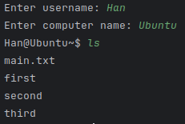

# Эмулятор консоли
Разработать эмулятор для языка оболочки ОС. Необходимо сделать работу
эмулятора как можно более похожей на сеанс shell в UNIX-подобной ОС.
Эмулятор должен запускаться из реальной командной строки, а файл с
виртуальной файловой системой не нужно распаковывать у пользователя.
Эмулятор принимает образ виртуальной файловой системы в виде файла формата
zip. Эмулятор должен работать в режиме CLI.

# Запуск
Запуск emulator.py: python emulator.py
```Bash
python emulator.py
```
Обязательно прописать путь к файловой системе в config.yaml

# Команды
**ls** - Список файлов и директорий
**cd** '<path>' - Смена директории
**exit** - Выход из эмулятора
**find** '<file>' - Вывод пути к файлу
**mkdir** '<name>' - Создание директории
**chmod** '<file>' '<number>' - Установка доступа

# Тесты
## ls


## cd

## exit

## find

## mkdir

## chmod

