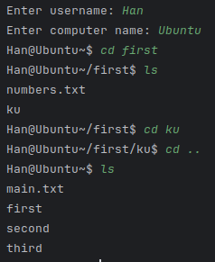
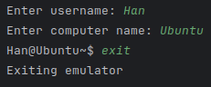
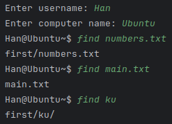
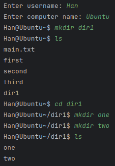
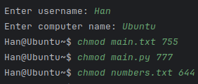
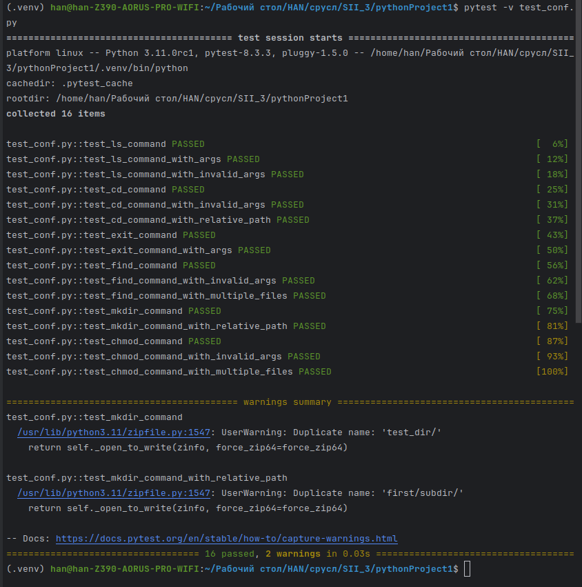

# Эмулятор консоли
Разработать эмулятор для языка оболочки ОС. Необходимо сделать работу
эмулятора как можно более похожей на сеанс shell в UNIX-подобной ОС.
Эмулятор должен запускаться из реальной командной строки, а файл с
виртуальной файловой системой не нужно распаковывать у пользователя.
Эмулятор принимает образ виртуальной файловой системы в виде файла формата
zip. Эмулятор должен работать в режиме CLI.

# Запуск
Запуск emulator.py: python emulator.py
```Bash
python emulator.py
```
Обязательно прописать путь к файловой системе в config.yaml

```Bash
pytest -v test_conf.py
```
Запуск тестов
# Необходимые библиотеки и их установка

```Bash
pip install -U pytest
```
библиотека для тестов

```Bash
pip install pyyaml
```
библитека yaml(для конфигурационных файлов)

```Bash
pip install lxml
```
для структуры файла  с расширением xml

# Команды
``` ls ``` - Список файлов и директорий

``` cd <path> ``` - Смена директории

``` exit ``` - Выход из эмулятора

``` find <file1> <file2> ... ``` - Вывод пути к файлу

``` mkdir <name> ``` - Создание директории

``` chmod  <number> <file1> <file2> ... ``` - Установка доступа

# Тесты
## ls

## cd

## exit

## find

## mkdir

## chmod

## Общие тесты через pytest

